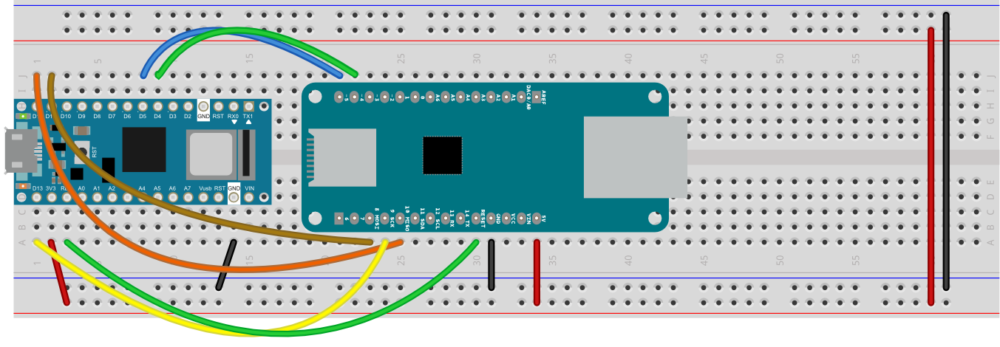

# sACN over Ethernet

This example shows how to send sACN from an Arduino over Ethernet. It was written with a Nano 33 IoT and a MKR Ethernet shield, as shown in Figure 1, but should work with any Arduino and any Ethernet shield that's compatible with the Ethernet library. 

Figure 1 shows the circuit. The code can be found at [this link]({{ site.github.repository_url }}/tree/main/examples/Example7_sACNEthernet). 

_Figure 1. Nano 33 IoT connected to a MKR Ethernet shield_

